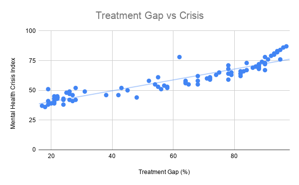
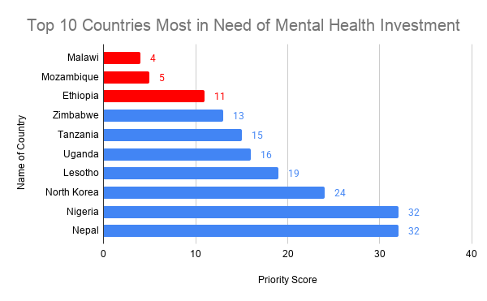

# Global Mental Health Crisis Analysis

## Overview
This project analyzes global mental health data to identify countries most in need of mental health resources. The analysis focuses on crisis severity, treatment access, and economic resources to determine where investment would have the greatest impact.

## Business Question
Which countries should be prioritized for mental health investment based on crisis severity, treatment access, and GDP per capita?

## Dataset
The dataset includes country-level metrics such as:
- Treatment Gap (%)
- Mental Health Crisis Index
- GDP per Capita
- Psychiatrists per 100k
- Region and Income Group

## Analysis
- Analyzed crisis severity by region  
- Explored the relationship between crisis index and treatment gaps  
- Examined the impact of GDP per capita on mental health outcomes  
- Compared psychiatrist availability to crisis severity  
- Built a priority model to identify countries most in need of investment  

## Key Findings
- Higher treatment gaps are strongly associated with higher mental health crisis severity  
- Countries with lower GDP per capita tend to have higher mental health crisis index scores  
- There is not a strong association between the number of psychiatrists and mental health crisis severity  
- High-priority countries are concentrated in low-income regions, particularly in Africa  

## Recommendations
- Prioritize countries with high treatment gaps and high crisis severity  
- Focus on improving access to mental health treatment rather than workforce expansion alone  
- Allocate resources to low-income regions where economic constraints limit access to care  
- Invest in infrastructure that increases access to mental health services  

## Visualizations
Key charts used in this analysis include:
- Mental Health Severity by Region  
- Treatment Gap vs Crisis Index (Scatter Plot)  
- GDP per Capita vs Crisis Index (Scatter Plot)  
- Top 10 Countries Most in Need of Mental Health Investment

## Sample Visuals

### Treatment Gap vs Crisis

## Conclusion
Mental health crisis severity is most strongly associated with limited access to treatment and economic constraints. Countries with high treatment gaps and low GDP consistently experience the worst outcomes, indicating that investment in low-income regions would have the greatest impact.
